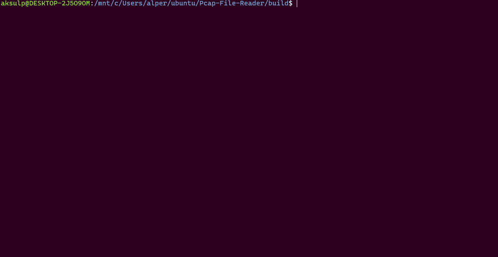

# Pcap-File-Parser
## Description
This repository contains source codes that can be built for the executable to list how many packets which been already recorded in the PCAP file sent from the IP addresses of these packets. Also with the given IP address as the second parameter, it produce number of packets which been sent from that address
## Build
**Note:: working in project directory**
```
mkdir build
cd build
cmake ..
cmake --build .
```
## Demonstration

To list each one of the packet counts which by sent from their sender IP addresses
```
>./Project1 <path-to-input-pcap-file>
```
To produce packet number which by count packets sent by given IP address  
```
>./Project1 <path-to-input-pcap-file> <IP-Address>
```
## Diagram

